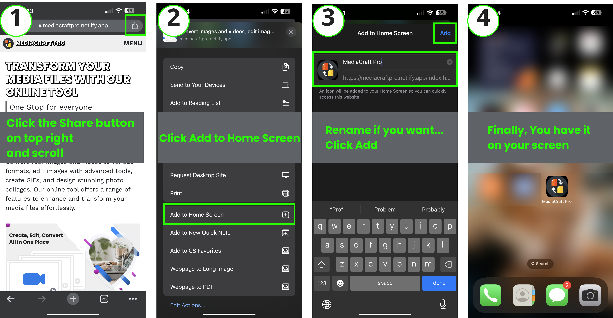
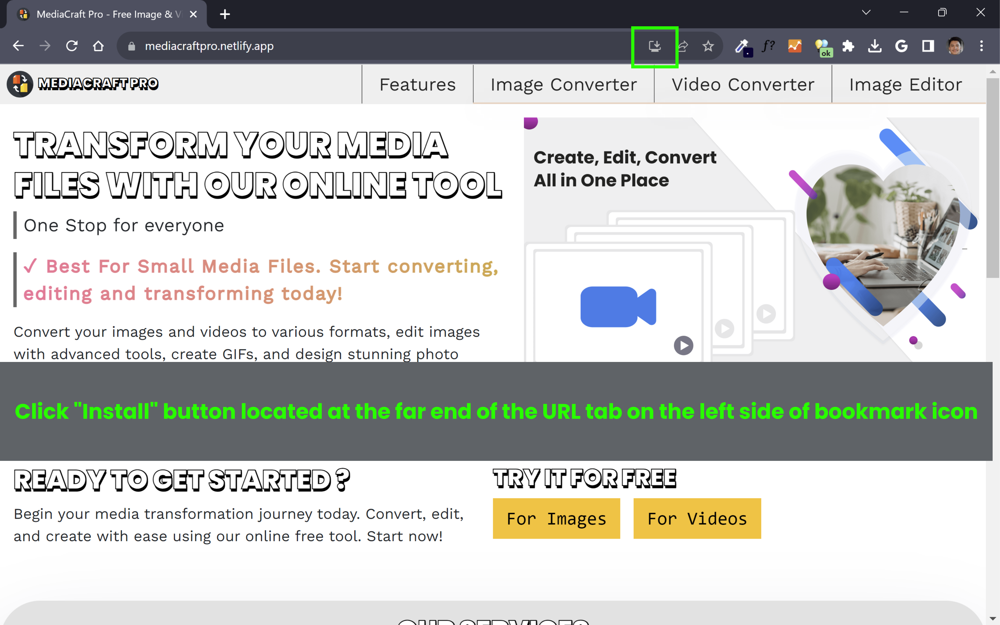

# MediaCraft PRO

Welcome to [MediaCraft PRO](https://mediacraftpro.netlify.app) – your all-in-one online browser-based media manipulation tool. Built with plain JavaScript, this tool offers a user-friendly interface and a wide range of supported formats, to effortlessly convert your images and videos, edit, make gifs, get custom photo collages and more.

Ready to start converting, editing, and creating dynamic media files? [Visit the MediaCraft PRO website](https://mediacraftpro.netlify.app) and experience the future of online media tools.

### Features

**Image Conversion:** Effortlessly convert images to a variety of formats, including JPG, PNG, AVIF, and WebP.

**Video Conversion:** Seamlessly convert videos to popular formats such as MP4, MOV, MKV, WMV, AVI, and WebM.

**Image Editing:** Edit images directly within the tool, allowing you to enhance and modify your visuals without the need for external software.

**GIF Creation:** Craft captivating GIFs from both images and videos, enabling you to create dynamic and shareable content.

**Custom Collage:** Thoughfully created limited custom photo collages, to make your memories more shareable.

### How to add/install this web app?

#### Add to phone (iOS)

- Visit [MediaCraft PRO](https://mediacraftpro.netlify.app)
- Press the "Share" button and select "Add to Home Screen" from the popup.
- Lastly, tap "Add" in the top right corner to finish installing the PWA.

These steps are specifically for adding in iPhones using Google Chrome.
Steps may vary for a different device and browser.
Example: Device - Andriod, Browser - Safari...

#### Install in desktop (windows)

- Visit [MediaCraft PRO](https://mediacraftpro.netlify.app)
- Click Install from the URL tab.

### How to Use?

1. Visit the [MediaCraft PRO website](https://mediacraftpro.netlify.app).
2. Upload your desired image or video file.
3. Choose the desired output format from the available options.
4. For images, utilize the built-in editing tools to enhance your visuals.
5. Create engaging GIFs by selecting multiple images or videos.
6. Download the newly converted or edited files to your device.

### Why MediaCraft PRO?

**Ease of Use:** No need to install any software – simply access the tool through your web browser. No SignIn | SignUp required.

**Wide Format Support:** Whether you're dealing with images or videos, MediaCraft PRO supports a diverse range of formats, ensuring your compatibility needs are met.

**On-the-Go Access:** Access and utilize MediaCraft PRO from any device with an internet connection, making it a versatile solution for your media manipulation needs.

**Edit with Confidence:** Modify images and create GIFs with ease, knowing that your original files remain untouched, thanks to the non-destructive editing process.

### MediaCraft PRO Limitation

1. File size limits for image conversion are set to 10MB per image and for video conversion is 100MB per video to maintain efficient processing within the user's browser environment.
2. For GIF creation, image size is limited to 5MB per file and video size is limited to 10MB per file.

### Libraries And Dependencies Used

- [CamanJS](http://camanjs.com/)
- [GIFShot](https://yahoo.github.io/gifshot/demo.html)
- [File Reader API](https://w3c.github.io/FileAPI/#dfn-filereader)
- [Web API](https://developer.mozilla.org/en-US/docs/Web/API)
- [JSZip](https://www.npmjs.com/package/jszip)
- [CropperJS](https://github.com/fengyuanchen/cropperjs)

**[Developer's Note](https://www.linkedin.com/in/sachin-samal005/):** [This project](https://github.com/Sacsam005/MediaCraft-PRO) is under active development, and new features may be added regularly. Feel free to contribute by submitting pull requests and suggesting improvements. For bug reports or feature requests, please open an issue on our [GitHub repository](https://github.com/Sacsam005/MediaCraft-PRO). Your feedback is invaluable as we continue to enhance and refine MediaCraft PRO.

> Fellow developers, we have integrated the [RemoveBg's API](https://www.remove.bg/api#remove-background) to enable background removal on our website. However, our free trial has expired, because of which the API request throws 402 Payment Required error. Nonetheless, the code works perfectly fine if a paid version of subscription is used. Feel free to play around with the code with your key.
